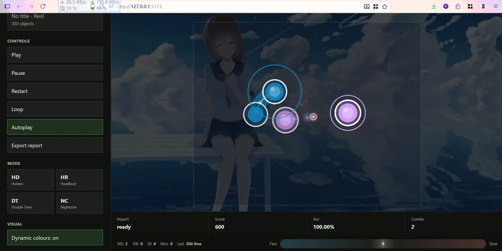

# oszillator

An unofficial osu!standard-style player experiment for the browser.

`oszillator` started from a simple idea: what if osu!standard could run in a web page, just because it would be fun? Drop a beatmap archive into the browser, pick a difficulty, and click circles. The app parses the map locally, keeps the Web Audio clock as the gameplay timeline, renders the playfield with Pixi, and keeps scores on your machine only.

## Online Demo

Try the hosted demo here: https://n0zom1z0.github.io/oszillator/

The demo is a static GitHub Pages build of the same browser player. Import a `.osz` archive from your own machine and the beatmap, background, video, and audio are processed in your browser; the app does not upload beatmap files or submit scores to a server. The page also includes a small showcase so the first screen is not empty before you import your own archive.

[](https://www.youtube.com/watch?v=0RBsNySsgOs)

> Watch the autoplay demo on YouTube: https://www.youtube.com/watch?v=0RBsNySsgOs

## Highlights

- Drag-and-drop `.osz` import with no account, server sync, or online beatmap download.
- osu!standard-focused gameplay with circles, sliders, spinners, hit judgements, combo, accuracy, and local scores.
- Web Audio based timing so judgement uses the audio clock rather than frame deltas.
- Autoplay showcase mode for hands-free previews and visual demos.
- osu!-style modifiers: Hidden, HardRock, Double Time, and Nightcore.
- Beatmap background image and browser-supported video playback from the imported archive.
- Dynamic cursor trail, spinner effects, smoke key, hit offset history, and optional dynamic colour cycling.
- Parser and loader designed to warn and continue when real-world `.osu` files contain unknown fields.

## Controls

- `Z` / `X`: keyboard hit buttons.
- Mouse / pointer: aim and click.
- `C`: smoke trail.
- `Autoplay`: let oszillator perform an idealized replay.
- `Dynamic colours`: opt into animated palette cycling for cursor and objects.

## Product Boundaries

- Unofficial osu!standard-style browser experiment.
- osu!standard-style gameplay only.
- Local archive import only.
- No ranking, leaderboard, login, server sync, or online score submission.
- No online beatmap search or download.
- No official branding or bundled official assets.
- No copyrighted beatmap, audio, or video fixtures are committed to this repository.

## Development

```bash
corepack pnpm install
corepack pnpm dev
corepack pnpm typecheck
corepack pnpm test
corepack pnpm build
corepack pnpm test:e2e
```

## Workspace

- `apps/player`: Vite browser app and UI orchestration.
- `packages/audio-engine`: Web Audio clock, playback, offsets, and hitsounds.
- `packages/core`: shared math, time, playfield transforms, search, and input primitives.
- `packages/osu-parser`: warning-first `.osu` parser.
- `packages/osz-loader`: `.osz` unzip and manifest generation.
- `packages/renderer-pixi`: Pixi gameplay renderer.
- `packages/ruleset-std`: osu!standard preparation, modifiers, judgement, and scoring.
- `packages/slider-geometry`: deterministic slider path helpers.
- `packages/storage`: local metadata, settings, and scores.

## Media

The repository includes a lightweight demo poster in `docs/assets/demo-poster.jpg`. Keep full recordings outside the git history unless there is a strong reason to version them. See [docs/media.md](docs/media.md) for the recommended README video workflow.
